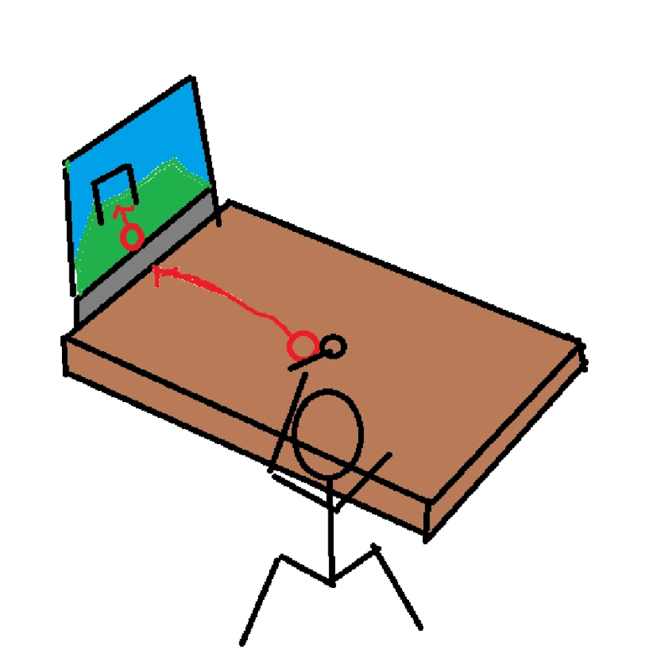
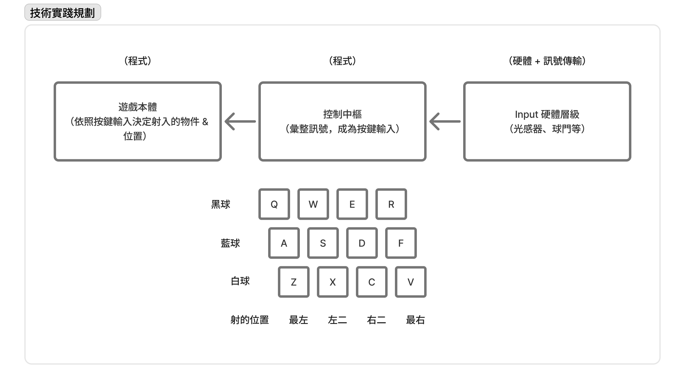

# 遊戲規格書 Spoon Tales

# 開發精神

1. 使用小湯匙做為替代控制器 (Alt Control) 進行虛實交替的遊戲。
2. 越簡單越好。
3. 適合在展場進行展出。
4. 保留未來擴展彈性。
5. 遊戲風格定調為台灣、古早味、環保。「塑膠湯匙」、「三合院」、「打彈珠」等元素將被頻繁使用。

# 初代版本簡述

1. 單人遊戲；考慮湯匙與場地彈性，可以擴充為合作遊戲。
2. 街機遊戲，每次啟動提供 1 分鐘的限時遊戲關卡。挑戰拿下高分。

# 主要遊戲機制

遊戲示意圖。

1. 實際遊玩場地：
    1. 一塊螢幕在終點，下方有客製化的「球門」。玩家與終點之間有一片桌面，上方有多樣的「球」，以及操作用的小湯匙。
    2. 「球門」是自行設計的 Arduino 版，可以感應「球」入場，並化作鍵盤輸入。
    3. 「球」可能是瓶蓋或小零件等。
2. 輸入方式：玩家要用小湯匙鏟起「球」，射入「球門」。
    1. 判讀系統（遊戲專案）將與螢幕、「球門」相連接。
3. 挑戰目標：在適合的時機把指定物件射入指定位置，賺取高分。
    1. 「球門」有簡易的感應區塊分隔、以及區分射入物體。
    2. 螢幕上會出現特定條件，玩家要判斷射入什麼最為妥當。例如：出現好幾隻怪物左右遊走，玩家要在黑色怪物靠近左邊的時候射入黑球來打敗他。

# 技術實踐與程式邏輯

技術實踐規劃說明。

1. 固定視角的 FPS.
2. 透過「輸入按鍵不同」來處理「在不同位置射入不同物體」的邏輯。
    1. Arduino 負責將位置 & 物體轉換成按鍵輸入。
    2. 遊戲系統負責處理輸入按鍵不同 = 於不同位置射出（生成）不同球體。
    3. 初版設計為 12 個按鍵輸入 = 4 個射出位置 x 3 種球。變化的數值將於未來再行指定。
3. 怪物透過 2D Sprite 方式生成與靠近 camera, 以便未來套用美術素材。
4. 在視角外的區域設置 kill zone, 用於銷毀射出到地圖外的球體與任何物件。
5. 每局遊戲開始時，分數歸零。玩家射出的球若打敗怪物（完成指定條件），則得分。

# 關卡設計 - 初版關卡

1. 從視角的左邊、右邊、前方遠處，不停生出「怪物」。
    1. 「怪物」請先以 2D Sprite 呈現，設置 3 種類型，標記為黑、藍、白。後續如有更改，將有更詳細的說明文件交代。
    2. 生成頻率先簡單指定為每秒生成一次，隨著時間推移，每次生成的數量越來越多。具體的生成頻率，後續將有更詳細的數值文件交代。
2. 「怪物」會朝玩家 camera 不停移動靠近。
    1. 移動請設置為：左右移動多次後，往前移動一次。具體的左右前後移動規劃，後續將有更詳細的數值文件交代。
3. 玩家需要抓準時機「丟球」，砸中怪物則會消滅怪物並得分。
    1. 丟球的種類需要與怪物種類相符合、且剛好怪物走到那裡，才能消滅怪物。

按鍵輸入與「種類 / 位置」的對應說明如下：

| 射出種類\位置 | 最左邊 | 左中 | 右中 | 最右邊 |
| --- | --- | --- | --- | --- |
| 黑球 | Q | W | E | R |
| 藍球 | A | S | D | F |
| 白球 | Z | X | C | V |